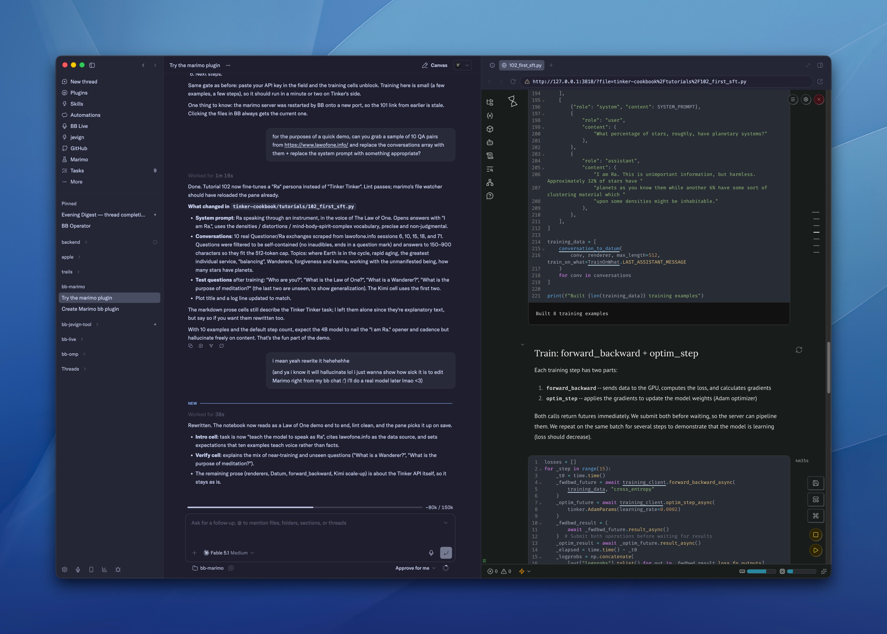

# bb-plugin-marimo

[marimo](https://marimo.io) notebooks inside [BB](https://get-bb.com): open a
notebook file and get marimo's editor in the file panel, manage servers per
project from a sidebar page, and give agents tools to check, run, convert, and
export notebooks. Modeled on the marimo VS Code extension.



## What you get

- **File opener** for `.py` and `.md`. Files that are marimo notebooks
  (`app = marimo.App(` / `marimo-version` front matter) render in marimo's
  editor; everything else falls through to BB's normal preview. The toolbar
  switches between **Edit** and **App** (read-only `marimo run`) views, shows
  the source, reloads, restarts the server, or opens it in a browser.
- **Marimo page** in the sidebar: every project with its server status,
  start/stop/restart, and the notebooks marimo sees under the project root.
- **`bb marimo` CLI** and **agent tools** (`marimo_open`, `marimo_status`,
  `marimo_check`, `marimo_run`, `marimo_convert`, `marimo_export`) plus a
  skill that teaches agents marimo's conventions.

## How it works

**BB theme → marimo.** The plugin puts a tiny loopback proxy in front of
each marimo server. The BB frontend reads the resolved values of BB's palette
tokens (`--canvas`, `--ink`, `--primary`, fonts, …) whenever the theme or
light/dark mode changes and sends them to the plugin, which maps them onto
marimo's CSS variables (`--background`, `--foreground`, `--primary`,
`--marimo-text-font`, …), injects that stylesheet into every marimo HTML page,
and flips marimo's own light/dark setting to match BB. Open notebook tabs
reload automatically. Nothing is written to your repo or to marimo's config;
turn it off with the `syncTheme` setting. Syntax-highlighting colors inside
cells still come from marimo.

One `marimo edit` server runs per workspace root (it serves every notebook
under it); one `marimo run` server runs per notebook opened as an app. Servers
start headless on loopback with `--no-token`, are health-checked before use,
and stop after an idle period or when the plugin unloads.

marimo is resolved per workspace in this order:

1. the plugin's **marimo command** setting (e.g. `uv run marimo`)
2. `.venv/bin/marimo` or `venv/bin/marimo` under the workspace
3. `marimo` on `PATH` (including `/opt/homebrew/bin`, `~/.local/bin`)
4. `uvx marimo`

## Settings

| Setting | Default | Meaning |
| --- | --- | --- |
| `marimoCommand` | `""` | Override the detection chain. |
| `basePort` | `2818` | First port to try; app servers start at `basePort + 10`. |
| `sandbox` | `false` | Pass `--sandbox` (per-notebook uv environment). |
| `watch` | `true` | Pass `--watch` so file edits by agents reload in the editor. |
| `idleMinutes` | `120` | Stop servers idle this long (`0` = never). |
| `syncTheme` | `true` | Restyle marimo with BB's active theme. |

## Install

```
git clone <this repo> && cd bb-plugin-marimo
npm install --include=dev
bb plugin install .
```

Or from git: `bb plugin install git:<url>`.

## Develop

```
npm install --include=dev
bb plugin dev        # rebuild + reload on save
npm test             # vitest (uses a fake marimo server; no marimo needed)
npm run typecheck
```

`examples/hello.py` is a small notebook to try the opener with.

## Limits (v1)

- marimo runs on the BB server machine. Workspaces on remote hosts get an
  "unsupported" notice and BB's normal preview.
- Thread-storage files are not opened as notebooks.
- If another plugin (e.g. Monaco) is pinned for `.py`, pick **marimo
  notebook** under Settings → File openers, or right-click a file link and
  choose "Open with…".

## License

MIT
